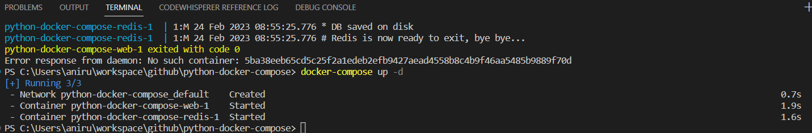

# Start your app using docker-compose

From your project directory, start up your application by running docker-compose up. Please note that we will use `d` flag to run the command in detached mode. 

```
C:\Users\aniru\workspace\docker\python-docker-compose> docker-compose up -d
```



As you can see, compose does the following :

* Compose pulls latest redis image from dockerhub
* Builds an image for your Dockerfile and binds it to exposed container port : 5000
* Starts both the services you defined. In this case, the code is statically copied into the image at build time.

You can now check the status of the containers with usual `docker ps` command. 
```
PS C:\Users\aniru\workspace\github\python-docker-compose> docker ps
CONTAINER ID   IMAGE                       COMMAND                  CREATED         STATUS         PORTS                    NAMES
205db680ecc6   python-docker-compose-web   "flask run"              3 minutes ago   Up 2 minutes   0.0.0.0:5000->5000/tcp   python-docker-compose-web-1      
92d7495e846d   redis:alpine                "docker-entrypoint.s…"   3 minutes ago   Up 2 minutes   6379/tcp                 python-docker-compose-redis-1   
```