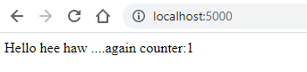

## Run your app in your browser
Enter http://localhost:5000/ on your browser. You should see 




## Check inside the container
Now that all is running fine. Let's check inside the container how it was built. We will use the container-id of the web-app container

```
PS C:\Users\aniru\workspace\github\python-docker-compose> docker ps             
CONTAINER ID   IMAGE                       COMMAND                  CREATED          STATUS          PORTS                    NAMES
205db680ecc6   python-docker-compose-web   "flask run"              13 minutes ago   Up 13 minutes   0.0.0.0:5000->5000/tcp   python-docker-compose-web-1    
92d7495e846d   redis:alpine                "docker-entrypoint.s…"   13 minutes ago   Up 13 minutes   6379/tcp                 python-docker-compose-redis-1 
```
```
docker exec -it  205db680ecc6 /bin/sh
```
```
PS C:\Users\aniru\workspace\github\python-docker-compose> docker exec -it  205db680ecc6 /bin/sh
/code # ls
Dockerfile           __pycache__          command-list.md      docs                 requirements.txt
README.md            app.py               docker-compose.yaml  mkdocs.yml           site
/code #
```
Notice that the workdir is set to `/code` as specified in the DockerFile

## Shutdown all the containers
Let's shut it all down.
```
docker-compose down
```

```
PS C:\Users\aniru\workspace\github\python-docker-compose> docker-compose down
[+] Running 3/3
 - Container python-docker-compose-redis-1  Removed                                                                                                     0.6s 
 - Container python-docker-compose-web-1    Removed                                                                                                     1.2s 
 - Network python-docker-compose_default    Removed          
 ```